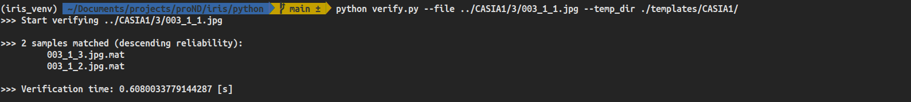

# Iris Recognition

This is based on the work by [Thuy Ng](https://www.github.com/thuyngch). His original Iris Recognition System implemented in both MatLab and Python can be found [here](https://github.com/thuyngch/Iris-Recognition).

## Description

This system is incomplete for a real-world application. A complete system must have a specific camera to capture the iris of the eye. However, these cameras are very expensive. Therefore available image databases [CASIA-IrisV1](http://biometrics.idealtest.org/dbDetailForUser.do?id=1) and [MMU2](http://andyzeng.github.io/downloads/MMU2IrisDatabase.zip) are used to replace the costly cameras. All testing and machine learning classification are carried out using images in these databases.

Typically, a recognition system involves two operation modes, namely Enrollment and Verification.

**Enrollment** is extracting features from an eye image and saving it into a template database.

**Verification** allows users extract their features and match with existing entities in the template database to identify the origination of the input image.

These system utilizes all CPU cores to boost computation time.

## Set Up

These system was deployed and executed on an Ubuntu 20.04 OS and the Python interpreter is Python 3.8.5.

First, create a virtual environment

```bash
python3 -m venv iris_venv 
source iris_venv/bin/activate
```

Clone this repository

```bash
git clone https://github.com/Th3nn3ss/python-iris-recognition.git
cd python-iris-recognition
```

Install requirements

```bash
pip install -r requirements.txt
```

## Folder Structure

```bash
.
+-- CASIA-database/
|   +-- 001_1_1.jpg
|   +-- ...
|   +-- 108_2_4.jpg
|

+-- MMU2-database/
|   +-- 010101.bmp
|   +-- ...
|   +-- 1000205.bmp

+-- python/
|   +-- fnc/
|       +-- boundary.py
|       +-- ...
|   +-- template-database/  # Created when an image is enrolled
|       +-- 1.mat
|       +-- ...
|   +-- enroll-casia1.py
|   +-- enroll-mmu2.py
|   +-- eval_casia1.py
|   +-- eval_mmu2.py
|   +-- requirements.txt
|   +-- verify.py
```


* Folder <code> CASIA-database</code> includes original eye images. These system uses these images as the input.

* Folder <code>python</code>contains the following folders.

   -  Folder <code>fnc</code>, this contains the back-end functions. 		_

   -  Folder <code>template-database </code> stores registered template extracted from eye images, it is created when an image is enrolled.

   -  File <code>enroll-casia1.py</code>enrolls the images in the CASIA1 folder.

   -  File <code>enroll-mmu2.py</code> enrolls the images in the MMU2 folder.

   -  File <code>eval-casia1.py</code> is used to execute a Machine Learning Classification Algorithm that determines the Maximum fscore, Best eye_threshold and Best threshold for the CASIA1 Database. This process does not have to be repeated but you can re-run to check the following results, 

      

      

      File <code>eval-mmu2.py</code> is used to execute a Machine Learning Classification Algorithm that determines the Optimal Maximum fscore, Best eye_threshold and Best threshold for the images in the MMU2 Database. This process does not have to be repeated but you can re-run to check the following results.

      

      

      File <code> verify.py </code> is used to verify if an image sample can be recognized by the system from the pool of template images. The default threshold used for matching is 0.38. 

## Usage

### To Enroll a set of images

```bash
python enroll-casia1.py
```

In the above example, we are enrolling the CASIA1 Database into the system. This encodes the specially selected images using regex and the outputs are stored in a templates database sub-folder, in the case of this example a CASIA1 sub-folder.


###To Verify an image

```bash
python verify.py --file ../CASIA1/3/003_1_1.jpg --temp_dir ./templates/CASIA1/
```

In the above example, the file we are trying to verify is an image from the third folder in the CASIA1 Database. We point to the particular file by passing an argument to the <code> --file </code> flag.

Provided all images in the CASIA1 Database have been enrolled to the templates database. We can pass an argument to the <code>--temp_dir</code> flag, pointing to the templates sub-folder where the images were enrolled.

The default threshold used for matching is 0.38.

The outcome of the above code looks like this,



The image above shows that the image file 003_1_1.jpg matches 2 samples. 


## License

MIT